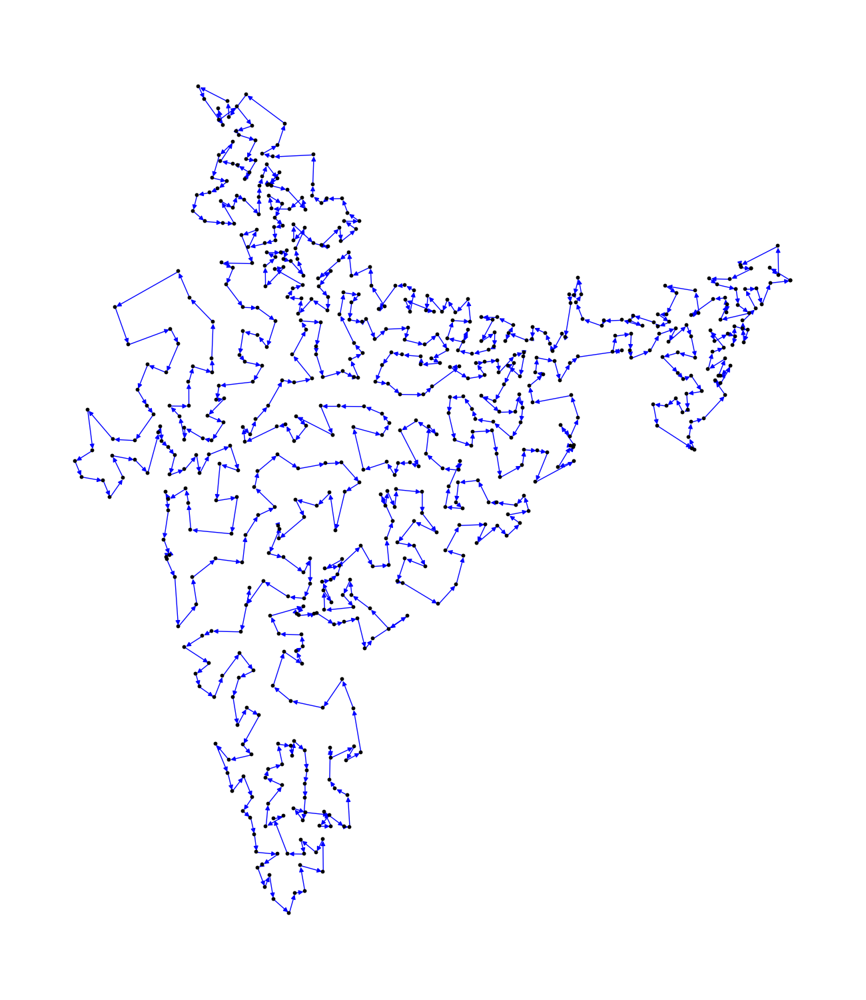

<h1>TSP (<a href="https://en.wikipedia.org/wiki/Travelling_salesman_problem">Travelling salesman problem</a>) for INDIA<h1>
<h4>TSP problem for India, all districts of India considered as a city that needs to be visited by salesperson and Delhi is the starting point for the salesperson.</h4>
<h4>We used the Lin-Kernighan algorithm for solving the TSP problem. The Lin-Kernighan algorithm code is directly taken from <a href="http://www.math.uwaterloo.ca/tsp/concorde.html">Concorde TSP Solver</a></h4>

<h2>Result</h2>

